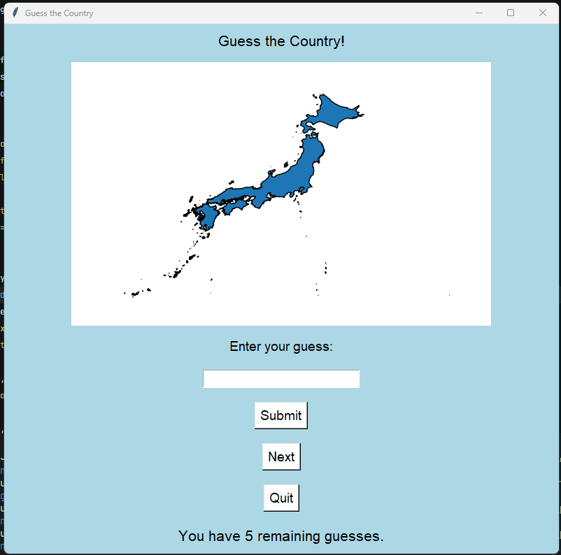

# GeoQuiz 🌍

GeoQuiz is an interactive geography game built with Python. 
The player is shown a country silhouette and must guess its name.



## How to Play
- A country silhouette is displayed on the screen
- Type your guess in the input field and click **Submit**
- You have **5 attempts** per country
- Click **Next** to load a new country
- Click **Quit** to exit the game

## Technologies
- **Python 3.12**
- **Tkinter** — GUI
- **Fiona** — Reading GeoJSON files
- **Matplotlib** — Rendering country shapes
- **Descartes** — Polygon patches for Matplotlib

## Installation

```bash
# Clone the repository
git clone https://github.com/CleisonPaiva/geoquiz.git
cd geoquiz

# Create a virtual environment
conda create -n geospatial python=3.12
conda activate geospatial

# Install dependencies
conda install -c conda-forge geopandas fiona matplotlib
pip install descartes
```

## Running the Game

```bash
python main.py
```

## Data
Country shapes sourced from GeoJSON files. Each country is stored as an individual `.geojson` file in the `data/countries/` folder.
